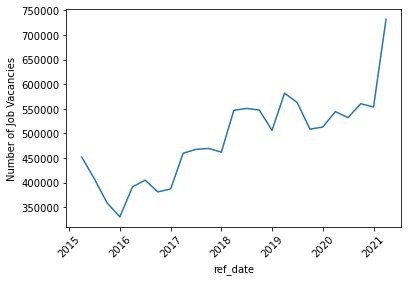
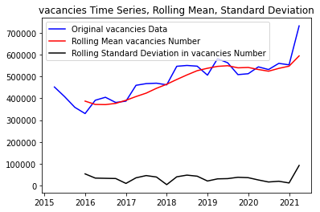

# Machine Learning Models

## Introduction 

 MLP Regressor and SARIMAX models are used in this project for the following reasons:

* To cover all data available in the data source and  predict job vacancies at broad and granular levels
* Data exploratory analysis showed missing values from different provinces, NOCs, Job characteristics level
Each model have its strengths and limitations and using both provides best answers to the project's quastions.

## MLP Regressor Model

### Description of preliminary data preprocessing

- Changed all dates in "REF_DATE" to string format ("%Y-%M"), so we can split into year and quarter
- Dropped columns: "id", "noc_code","predicted_vacancies"
- Dropped rows: GEO == "Canada", NOC == "Total, all occupations", REF_DATE == '2020-10', '2021-01', '2021-04'
- renamed all columns to uppercase and simplier names for future coding
- Changed "VALUE" to int

### Description of preliminary feature engineering and preliminary feature selection, including their decision-making process

- Creation of Year (Int) and Quarter (Int) columns from REF_DATE (String)
 
this will allow the ML model to see the trend in quarters within the year more accuractely

- Creation of previous quarter vacancy (PREVIOUS_VACANCY (Int))

This is an important column for the MLP Regressor model so it can more accurately predict the next quarters vacancy amount. 

- We also use GEO, NOC and JOB Char for these three columns we do label encoding first, then one hot coding, afterwards remerging into main dataframe. 

GEO - Contains 13 Provinces of Canada :  'Alberta', 'British Columbia',
        'Manitoba', 'New Brunswick', 'Newfoundland and Labrador',
        'Northwest Territories', 'Nova Scotia', 'Nunavut', 'Ontario',
        'Prince Edward Island', 'Quebec', 'Saskatchewan', 'Yukon'

This was an decided to use only the provinces so we could see how the location affects job vacancies, and throughout the data we can see it makes a big difference depending on what location you are. After the two encodings we end up with 13 new columns and we drop GEO column.

NOC - Contains 10 broad classifications: 'Business, finance and administration occupations',
        'Health occupations', 'Management occupations',
        'Natural and applied sciences and related occupations',
        'Natural resources, agriculture and related production occupations',
        'Occupations in art, culture, recreation and sport',
        'Occupations in education, law and social, community and government services',
        'Occupations in manufacturing and utilities',
        'Sales and service occupations',
        'Trades, transport and equipment operators and related occupations'

NOC allows us to see which industry on a broad level and the affect on the job vacancies and trends. After two encodings we have 10 new columns and we drop the old NOC column.

JOB_CHAR: Contains two characteristic: 'Full-time', 'Part-time'

There are many more in the original data set, however, we chose just these two for simplicity and their relation to job vacancies, since some characteristics do not have any correlation to each other. i.e. Job Vacancy for 1-5 days. 

We have a total of 28 Features: 'YEAR',
 'QUARTER',
 'PREVIOUS_VACANCY',
 'Alberta',
 'British Columbia',
 'Manitoba',
 'New Brunswick',
 'Newfoundland and Labrador',
 'Northwest Territories',
 'Nova Scotia',
 'Nunavut',
 'Ontario',
 'Prince Edward Island',
 'Quebec',
 'Saskatchewan',
 'Yukon',
 'Business, finance and administration occupations',
 'Health occupations',
 'Management occupations',
 'Natural and applied sciences and related occupations',
 'Natural resources, agriculture and related production occupations',
 'Occupations in art, culture, recreation and sport',
 'Occupations in education, law and social, community and government services',
 'Occupations in manufacturing and utilities',
 'Sales and service occupations',
 'Trades, transport and equipment operators and related occupations',
 'Full-time',
 'Part-time'

### Description of how data was split into training and testing sets

The training and testing data was split into 80% training, and 20% testing. With a total of 2456 rows for input, 492 rows for testing, 1964 for training. 

Both X_train and X_test are scaled before fitting the model, this will help improve accuracy of our model due to the nature of year and quarter being vectors.

### Explanation of model choice, including limitations and benefits

We tried three different models to work on the dataset, Linear regression, MLPRegressor, and Random Forest

Linear regression was too simple for predictions, the accuracy although was 0.96 was the worst out of the three models, therefor, we decided to not use this model and try different ones. 

MLPRegressor, had the highest accuracy and ability to make accurate predictions. After exporting the testing data and predictions into tableau we could see it accurately predicted trends, and had the highest accuracy, thus we chose this model for future analysis and prediction of our data. 

Random Forest, had high accuracy, however, due to its nature was not good at predictions, it would predict the future value as current value, which is not what we aimed to achieve with this project. 

The limitation of MLP model predicts negative job vacancies which isn't possible, however, this negative is due to the fact some job vacancies are so low the model predicts it will go negative in the future. In the future we will look into how we can prevent the model from predicting negative values. 

Benefits of MLP, it has the highest accuracy and prediction and all the trends for every single year, quarter, geo, noc and job_char are the same, so we can conclude our model is accurate, you can see from the chart below it can accuractly predict the values where the charts look very similar. 

## Time Series SARIMAX Machine Learning Model

### Description of preliminary data preprocessing
The folowing steps are performed as the nescessary preprocessing for the model:
1. converting the REF_DATE column into a datetime object
2. Setting the REF_DATE column as the dataframe index

###  Description of preliminary feature engineering and preliminary feature selection, including their decision-making process
* No feature engineering is needed to implement the time series model
* Time series model takes two inputs; a time stamp and a continuos variable.
* stationary, autoregression and trend decomposition tests were performed to undertand the chracteristics of the data
* Identification of model parameters required a grid search to find the combination of prameters that gives the best accuracy metrics including:
 * MAPE
 * ME
 * MAE
 * MPE
 * rmse
 * acf1
 * corr
 * minmax

### Description of how data was split into training and testing sets

The data was split 85% training and 15% testing

###  Explanation of model choice, including limitations and benefits
SARIMA model is chosen to predict the number of vancancies on Canada and on province levels as the data presents both components of trend and seasonality.

Benifits:
* best used for time series with seasonality as it  allows for long-term trend and seasonal effects.

Limitations:
* high RMSE for provinces with high variation in number of vancacies
* the model is limited to predicted number of vacancies in quarter with unexpected high number of vacancies. for exmaple: Q2 2021 (post-COVID19 reopening)

# SARIMAX Machine Learning Model
The main objectives of using time series SARIMAX machine learning model is to understand the underlying patterns and past dynamics of the projects dataset and predict the number of vacancies on Canada and province levels. It is also suited for data sets that have seasonal cycles and trend.

## Description of preliminary data preprocessing
The folowing steps are performed as the nescessary preprocessing for the model:
1. Slicing data for 'Canada', 'Total, all occupations' in NOC, and 'Total, all occupations' in job_char
2. Remove unnecessary columns
3. Converting the REF_DATE column into a datetime object
4. Setting the REF_DATE column as the dataframe index

##  Description of preliminary feature engineering and preliminary feature selection, including their decision-making process
*  feature engineering:
    Impute missing data for Q2 & Q3 2020 Canada and province level
* Time series analysis including stationary, autoregression and trend decomposition tests were performed to undertand the chracteristics of the data. it helped in understanding and facilatating feature selection:
 * visualizing the time series data
 

 * checking for stationary, a stationary time series will not have any trends or seasonal patterns. We used the Dickey Fuller test to check for stationarity in our data. 
 
 
 
  Our data is not stationary as p value is higher than 0.05.

 * Checking for autocorrelation in time series data, this is a measure of how correlated time series data is at a given point in time with past values. 
 
 
 
 
 The data is autocorrelated and the results are shown below:

    One Quarter Lag:  0.8145162959523269
    Two Quaretrs Lag:  0.7294501466461943
    Three Quaretrs Lag:  0.685410879335562
    Four Quaretrs Lag:  0.7399548793483853

    * Checking for Trend decomposition to visualize the trends in time series data
    

    From this plot, we can clearly see the increasing trend in number of vacancies and the seasonality patterns in the rise and fall in values each year.

* Identification of model parameters required a grid search to find the combination of prameters that gives the best accuracy metrics.

Model accuaracy metrics:
* Explained Variance Score : 0.12
* Mean Square Error : 64963
* Root Mean Square Error : 254.9
* Coefficient of determination Training (R^2) : -0.063

## Description of how data was split into training and testing sets

The data was split 85% training and 15% testing chronologically for the first model creation

##  Explanation of model choice, including limitations and benefits
SARIMA model is chosen to predict the number of vancancies on Canada and on province levels as the data presents both components of trend and seasonality. It is one of the easiest and effective machine learning algorithm to performing time series forecasting.

Benifits:
* best used for time series with seasonality as it  allows for long-term trend and seasonal effects.
* easy to intrept the results

Limitations:
* high RMSE for provinces with high variation in number of vancacies
* limited ability to deal with outliers

